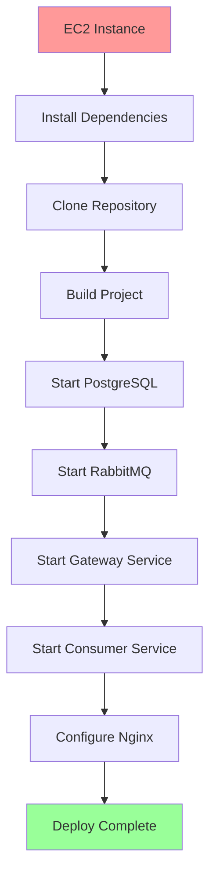

# 🚀 Deploy em VM na AWS - Guia Completo

Este guia mostra como fazer deploy do sistema de pagamentos em uma VM na AWS usando diferentes abordagens.

## 📋 **Opções de Deploy**

### **1. Docker Compose (Recomendado)**

Mais simples, usando containers Docker

### **2. Terraform + Automatização**

Infraestrutura como código com provisionamento automatizado

### **3. Manual**

Setup passo a passo para entendimento completo

---

## 🐳 **Opção 1: Docker Compose**

### **Pré-requisitos**

- EC2 Instance (t3.medium ou superior)
- Ubuntu 22.04 LTS
- Portas abertas: 22, 80, 443, 8080, 8081, 15672

### **1. Setup da VM**

```bash
# Conectar na VM
ssh -i sua-chave.pem ubuntu@IP_DA_VM

# Clonar o projeto
git clone https://github.com/seu-usuario/payment-system.git
cd payment-system

# Executar setup automático
./aws-vm-setup.sh

# Logout e login novamente (para group docker)
exit
ssh -i sua-chave.pem ubuntu@IP_DA_VM
cd payment-system
```

### **2. Deploy da Aplicação**

```bash
# Deploy completo
./deploy-vm.sh
```

### **3. Verificar Serviços**

```bash
# Status dos containers
docker-compose ps

# Logs em tempo real
docker-compose logs -f

# Health checks
curl http://localhost:8080/api/v1/gateway/health
curl http://localhost:8081/actuator/health
```

### **4. Testar API**

```bash
# Pegar IP público
PUBLIC_IP=$(curl -s http://checkip.amazonaws.com)

# Criar empresa
curl -X POST http://$PUBLIC_IP:8080/api/v1/gateway/companies \
  -H "Content-Type: application/json" \
  -d '{
    "name": "Empresa Teste",
    "cnpj": "12345678901234",
    "externalCompanyId": "test-123"
  }'
```

---

## 🏗️ **Opção 2: Terraform (Automatizado)**

### **1. Preparar Terraform**

```bash
# Instalar Terraform
cd terraform

# Configurar variáveis
cat > terraform.tfvars <<EOF
aws_region = "us-west-2"
instance_type = "t3.medium"
public_key = "ssh-rsa AAAAB3NzaC1yc2E... sua-chave-publica"
git_repository = "https://github.com/seu-usuario/payment-system.git"
allowed_ssh_cidr = ["SEU_IP/32"]
EOF
```

### **2. Provisionar Infraestrutura**

```bash
# Inicializar Terraform
terraform init

# Planejar deploy
terraform plan

# Aplicar infraestrutura
terraform apply
```

### **3. Conectar e Deploy**

```bash
# Pegar informações de conexão
terraform output ssh_command
terraform output api_endpoint

# Conectar na VM
ssh -i ~/.ssh/payment-system-key ubuntu@$(terraform output -raw instance_public_ip)

# Aplicação já está configurada, fazer deploy
cd /opt/payment-system
./deploy-vm.sh
```

---

## 🔧 **Opção 3: Setup Manual Completo**

### **1. Criar EC2 Instance**

**Configuração mínima:**

- AMI: Ubuntu 22.04 LTS
- Instance Type: t3.medium (2 vCPU, 4GB RAM)
- Storage: 20GB GP3
- Security Group: Portas 22, 80, 443, 8080, 8081, 15672

### **2. Instalar Dependências**

```bash
# Conectar na VM
ssh -i sua-chave.pem ubuntu@IP_DA_VM

# Atualizar sistema
sudo apt update && sudo apt upgrade -y

# Instalar Docker
curl -fsSL https://get.docker.com -o get-docker.sh
sudo sh get-docker.sh
sudo usermod -aG docker ubuntu

# Instalar Docker Compose
sudo curl -L "https://github.com/docker/compose/releases/latest/download/docker-compose-$(uname -s)-$(uname -m)" -o /usr/local/bin/docker-compose
sudo chmod +x /usr/local/bin/docker-compose

# Instalar Java e Maven
sudo apt install -y openjdk-21-jdk maven git

# Logout e login novamente
exit
ssh -i sua-chave.pem ubuntu@IP_DA_VM
```

### **3. Deploy da Aplicação**

```bash
# Clonar projeto
git clone https://github.com/seu-usuario/payment-system.git
cd payment-system

# Build do projeto
mvn clean install -DskipTests

# Iniciar serviços
docker-compose up -d --build

# Aguardar inicialização
sleep 60

# Verificar status
docker-compose ps
```

---

## 🎯 **Fluxo Completo do Deploy**



## 📊 **Arquitetura na VM**

```
┌─────────────────────────────────────────────────────────────┐
│                        EC2 Instance                         │
│  ┌─────────────┐  ┌─────────────┐  ┌─────────────────────┐  │
│  │    Nginx    │  │  Gateway    │  │   Consumer Service  │  │
│  │   (Port 80) │  │ (Port 8080) │  │    (Port 8081)     │  │
│  └─────────────┘  └─────────────┘  └─────────────────────┘  │
│         │                │                     │            │
│         └────────────────┼─────────────────────┘            │
│                          │                                  │
│  ┌─────────────┐  ┌─────────────┐                          │
│  │ PostgreSQL  │  │  RabbitMQ   │                          │
│  │ (Port 5432) │  │ (Port 5672) │                          │
│  └─────────────┘  └─────────────┘                          │
└─────────────────────────────────────────────────────────────┘
```

## 🔒 **Configurações de Segurança**

### **Security Group Rules**

```bash
# SSH (restringir ao seu IP)
22/tcp from YOUR_IP/32

# HTTP/HTTPS
80/tcp from 0.0.0.0/0
443/tcp from 0.0.0.0/0

# Gateway API
8080/tcp from 0.0.0.0/0

# RabbitMQ Management (opcional)
15672/tcp from YOUR_IP/32

# Monitoring (opcional)
3000/tcp from YOUR_IP/32
```

### **Firewall (UFW)**

```bash
sudo ufw allow ssh
sudo ufw allow 80
sudo ufw allow 443
sudo ufw allow 8080
sudo ufw --force enable
```

## 📈 **Monitoramento**

### **Health Checks**

```bash
# Gateway Service
curl http://IP_DA_VM/api/v1/gateway/health

# Consumer Service
curl http://IP_DA_VM:8081/actuator/health

# RabbitMQ
curl http://IP_DA_VM:15672
```

### **Logs**

```bash
# Ver todos os logs
docker-compose logs -f

# Log específico do serviço
docker-compose logs -f gateway-service
docker-compose logs -f consumer-service

# Logs do sistema
sudo journalctl -f
```

### **Stack de Monitoramento (Opcional)**

```bash
# Iniciar Prometheus + Grafana
cd monitoring
docker-compose -f docker-compose.monitoring.yml up -d

# Acessar Grafana
http://IP_DA_VM:3000 (admin/admin123)
```

## 💾 **Backup e Manutenção**

### **Backup Automático**

```bash
# Script já configurado para executar diariamente às 2:00
/usr/local/bin/backup-payment-system.sh

# Ver backups
ls -la /opt/backups/payment-system/
```

### **Manutenção**

```bash
# Restart dos serviços
sudo systemctl restart payment-system

# Update da aplicação
cd /opt/payment-system
git pull
docker-compose down
docker-compose up -d --build

# Limpeza do Docker
docker system prune -f
```

## 🚨 **Troubleshooting**

### **Serviços não iniciam**

```bash
# Verificar logs
docker-compose logs
sudo journalctl -u payment-system

# Verificar recursos
free -h
df -h
```

### **Problemas de conectividade**

```bash
# Testar portas
telnet IP_DA_VM 8080
netstat -tulpn | grep :8080

# Verificar Security Group
aws ec2 describe-security-groups --group-ids sg-xxxxx
```

### **Database issues**

```bash
# Conectar no PostgreSQL
docker exec -it payment-postgres psql -U postgres -d optica-db

# Ver tabelas
\dt

# Verificar dados
SELECT * FROM company LIMIT 5;
```

## 💰 **Custos AWS**

### **Estimativa mensal (us-west-2)**

- **t3.medium**: ~$30/mês
- **20GB GP3**: ~$2/mês
- **Elastic IP**: ~$3/mês (se não usado)
- **Data Transfer**: ~$5/mês (estimativa)

**Total: ~$35-40/mês**

## 🎯 **URLs de Acesso**

Após deploy completo:

- **API Gateway**: `http://IP_DA_VM`
- **RabbitMQ Management**: `http://IP_DA_VM:15672`
- **Grafana**: `http://IP_DA_VM:3000`
- **Direct Gateway**: `http://IP_DA_VM:8080`
- **Consumer Health**: `http://IP_DA_VM:8081/actuator/health`

## ✅ **Checklist de Deploy**

- [ ] EC2 Instance criada e acessível
- [ ] Security Group configurado
- [ ] Dependências instaladas
- [ ] Projeto clonado e buildado
- [ ] PostgreSQL funcionando
- [ ] RabbitMQ funcionando
- [ ] Gateway Service respondendo
- [ ] Consumer Service processando
- [ ] Nginx configurado
- [ ] Health checks passando
- [ ] API testada
- [ ] Backups configurados
- [ ] Monitoramento ativo

---

**🎉 Deploy completo na AWS VM!** Seu sistema de pagamentos está rodando com alta disponibilidade, monitoramento e backups automáticos.
