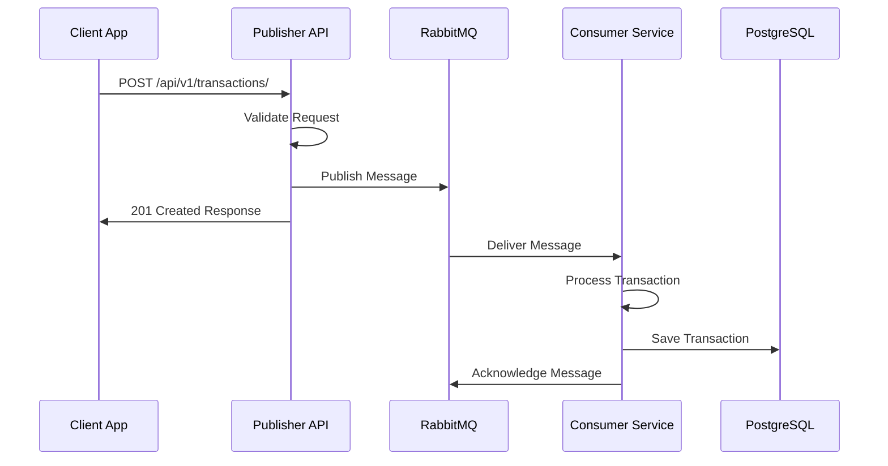

# Register Payment - Integration Guide

## 📋 Overview
Guia completo para integração com a API Register Payment. Este documento fornece todas as informações necessárias para que aplicações externas possam publicar transações no sistema.

## 🔗 Base URL
```
Production: https://register-payment-publisher.fly.dev
Staging: https://staging-register-payment-publisher.fly.dev (quando disponível)
```

## 🚀 Quick Start

### 1. Health Check
Verifique se a API está funcionando:
```bash
curl https://register-payment-publisher.fly.dev/api/v1/health
```

**Response:**
```json
{
  "status": "healthy",
  "timestamp": "2025-08-04T12:00:00Z",
  "service": "register-payment-publisher"
}
```

### 2. Publicar Transação
```bash
curl -X POST https://register-payment-publisher.fly.dev/api/v1/transactions/ \
  -H "Content-Type: application/json" \
  -d '{
    "transaction_id": "TXN-2025-001",
    "value": "150.75",
    "type": "in",
    "external_company_id": "COMPANY-ABC-123"
  }'
```

## 📡 API Endpoints

### POST /api/v1/transactions/
Cria uma nova transação no sistema.

**Headers:**
```
Content-Type: application/json
Accept: application/json
```

**Request Body:**
```json
{
  "transaction_id": "string",     // Identificador único da transação
  "value": "string",              // Valor monetário (formato decimal)
  "type": "string",               // Tipo: "in" (entrada) ou "out" (saída)
  "external_company_id": "string" // ID da empresa no sistema externo
}
```

**Success Response (201 Created):**
```json
{
  "message": "Transaction queued successfully",
  "transaction_id": "TXN-2025-001",
  "status": "queued",
  "queued_at": "2025-08-04T12:00:00Z"
}
```

**Error Responses:**

**400 Bad Request:**
```json
{
  "error": "validation_error",
  "message": "Invalid request data",
  "details": {
    "value": "must be a valid decimal number",
    "type": "must be either 'in' or 'out'"
  }
}
```

**500 Internal Server Error:**
```json
{
  "error": "internal_error",
  "message": "Failed to process transaction",
  "timestamp": "2025-08-04T12:00:00Z"
}
```

### GET /api/v1/health
Verifica o status da API.

**Success Response (200 OK):**
```json
{
  "status": "healthy",
  "timestamp": "2025-08-04T12:00:00Z",
  "service": "register-payment-publisher",
  "version": "1.0.0"
}
```

### GET /api/v1/metrics
Retorna métricas básicas do sistema.

**Success Response (200 OK):**
```json
{
  "uptime": "72h30m45s",
  "total_requests": 15847,
  "successful_requests": 15823,
  "failed_requests": 24,
  "queue_size": 12,
  "last_updated": "2025-08-04T12:00:00Z"
}
```

## 🔍 Field Specifications

### transaction_id
- **Type:** String
- **Required:** Yes
- **Max Length:** 100 characters
- **Pattern:** Alfanumérico com hífens e underscores
- **Example:** `"TXN-2025-001"`, `"PAY_ABC_123"`
- **Note:** Deve ser único por empresa

### value
- **Type:** String (decimal)
- **Required:** Yes
- **Format:** Decimal com até 2 casas decimais
- **Min Value:** 0.01
- **Max Value:** 999999999.99
- **Examples:** `"10.50"`, `"1000.00"`, `"0.99"`
- **Note:** Use ponto como separador decimal

### type
- **Type:** String (enum)
- **Required:** Yes
- **Values:** 
  - `"in"` - Transação de entrada (crédito)
  - `"out"` - Transação de saída (débito)
- **Example:** `"in"`

### external_company_id
- **Type:** String
- **Required:** Yes
- **Max Length:** 50 characters
- **Pattern:** Alfanumérico com hífens e underscores
- **Example:** `"COMPANY-ABC-123"`, `"CLIENT_XYZ_789"`
- **Note:** Identificador da empresa no sistema externo

## 🔄 Transaction Processing Flow



## 📚 Integration Examples

### JavaScript/Node.js
```javascript
const axios = require('axios');

async function createTransaction(transactionData) {
  try {
    const response = await axios.post(
      'https://register-payment-publisher.fly.dev/api/v1/transactions/',
      transactionData,
      {
        headers: {
          'Content-Type': 'application/json'
        }
      }
    );
    
    console.log('Transaction created:', response.data);
    return response.data;
  } catch (error) {
    console.error('Error creating transaction:', error.response?.data || error.message);
    throw error;
  }
}

// Usage
createTransaction({
  transaction_id: 'TXN-' + Date.now(),
  value: '299.99',
  type: 'in',
  external_company_id: 'MY-COMPANY-001'
});
```

### Python
```python
import requests
import json
from datetime import datetime

def create_transaction(transaction_data):
    url = 'https://register-payment-publisher.fly.dev/api/v1/transactions/'
    headers = {'Content-Type': 'application/json'}
    
    try:
        response = requests.post(url, json=transaction_data, headers=headers)
        response.raise_for_status()
        return response.json()
    except requests.exceptions.RequestException as e:
        print(f'Error creating transaction: {e}')
        if hasattr(e, 'response') and e.response is not None:
            print(f'Response: {e.response.text}')
        raise

# Usage
transaction = {
    'transaction_id': f'TXN-{int(datetime.now().timestamp())}',
    'value': '199.50',
    'type': 'in',
    'external_company_id': 'PYTHON-CLIENT-001'
}

result = create_transaction(transaction)
print('Transaction created:', result)
```

### PHP
```php
<?php
function createTransaction($transactionData) {
    $url = 'https://register-payment-publisher.fly.dev/api/v1/transactions/';
    
    $options = [
        'http' => [
            'header' => "Content-Type: application/json\r\n",
            'method' => 'POST',
            'content' => json_encode($transactionData)
        ]
    ];
    
    $context = stream_context_create($options);
    $result = file_get_contents($url, false, $context);
    
    if ($result === FALSE) {
        throw new Exception('Failed to create transaction');
    }
    
    return json_decode($result, true);
}

// Usage
$transaction = [
    'transaction_id' => 'TXN-' . time(),
    'value' => '75.25',
    'type' => 'in',
    'external_company_id' => 'PHP-CLIENT-001'
];

try {
    $result = createTransaction($transaction);
    echo 'Transaction created: ' . json_encode($result) . "\n";
} catch (Exception $e) {
    echo 'Error: ' . $e->getMessage() . "\n";
}
?>
```

### Java
```java
import java.net.http.HttpClient;
import java.net.http.HttpRequest;
import java.net.http.HttpResponse;
import java.net.URI;
import com.fasterxml.jackson.databind.ObjectMapper;
import java.util.Map;

public class TransactionClient {
    private static final String BASE_URL = "https://register-payment-publisher.fly.dev";
    private final HttpClient client = HttpClient.newHttpClient();
    private final ObjectMapper mapper = new ObjectMapper();
    
    public Map<String, Object> createTransaction(Map<String, Object> transactionData) throws Exception {
        String json = mapper.writeValueAsString(transactionData);
        
        HttpRequest request = HttpRequest.newBuilder()
            .uri(URI.create(BASE_URL + "/api/v1/transactions/"))
            .header("Content-Type", "application/json")
            .POST(HttpRequest.BodyPublishers.ofString(json))
            .build();
            
        HttpResponse<String> response = client.send(request, HttpResponse.BodyHandlers.ofString());
        
        if (response.statusCode() != 201) {
            throw new RuntimeException("Failed to create transaction: " + response.body());
        }
        
        return mapper.readValue(response.body(), Map.class);
    }
    
    // Usage
    public static void main(String[] args) throws Exception {
        TransactionClient client = new TransactionClient();
        
        Map<String, Object> transaction = Map.of(
            "transaction_id", "TXN-" + System.currentTimeMillis(),
            "value", "449.99",
            "type", "in",
            "external_company_id", "JAVA-CLIENT-001"
        );
        
        Map<String, Object> result = client.createTransaction(transaction);
        System.out.println("Transaction created: " + result);
    }
}
```

## ⚠️ Best Practices

### 1. Error Handling
```javascript
// Sempre implemente retry logic para falhas temporárias
async function createTransactionWithRetry(data, maxRetries = 3) {
  for (let attempt = 1; attempt <= maxRetries; attempt++) {
    try {
      return await createTransaction(data);
    } catch (error) {
      if (attempt === maxRetries || error.response?.status < 500) {
        throw error; // Falha permanente ou última tentativa
      }
      
      // Aguarda antes de tentar novamente
      await new Promise(resolve => setTimeout(resolve, 1000 * attempt));
    }
  }
}
```

### 2. Transaction ID Generation
```javascript
// Gere IDs únicos e identificáveis
function generateTransactionId(companyId, type) {
  const timestamp = Date.now();
  const random = Math.random().toString(36).substring(2, 8);
  return `${companyId}-${type.toUpperCase()}-${timestamp}-${random}`;
}
```

### 3. Validation Before Sending
```javascript
function validateTransaction(data) {
  const errors = [];
  
  if (!data.transaction_id || data.transaction_id.length > 100) {
    errors.push('transaction_id is required and must be <= 100 characters');
  }
  
  if (!data.value || !/^\d+(\.\d{1,2})?$/.test(data.value)) {
    errors.push('value must be a valid decimal with up to 2 decimal places');
  }
  
  if (!['in', 'out'].includes(data.type)) {
    errors.push('type must be "in" or "out"');
  }
  
  if (!data.external_company_id || data.external_company_id.length > 50) {
    errors.push('external_company_id is required and must be <= 50 characters');
  }
  
  return errors;
}
```

## 🔒 Security Considerations

### 1. HTTPS Only
- Sempre use HTTPS para comunicação com a API
- Nunca envie dados sensíveis via HTTP

### 2. Rate Limiting
- API implementa rate limiting por IP
- Limite atual: 1000 requests por minuto
- Headers de resposta incluem informações de rate limit

### 3. Input Validation
- API valida todos os inputs
- Sanitização automática de dados
- Proteção contra injection attacks

## 📊 Monitoring & Observability

### Request Headers for Tracking
```http
X-Request-ID: unique-request-identifier
X-Client-Version: your-app-version
X-Client-Name: your-app-name
```

### Response Headers
```http
X-Request-ID: unique-request-identifier
X-Processing-Time: 45ms
X-Rate-Limit-Remaining: 999
X-Rate-Limit-Reset: 1625097600
```

## 🚨 Error Codes Reference

| Status Code | Error Type | Description | Retry |
|-------------|------------|-------------|-------|
| 400 | validation_error | Invalid request data | No |
| 401 | authentication_error | Invalid or missing auth | No |
| 403 | authorization_error | Insufficient permissions | No |
| 409 | conflict_error | Duplicate transaction_id | No |
| 429 | rate_limit_error | Too many requests | Yes |
| 500 | internal_error | Server error | Yes |
| 502 | bad_gateway | Upstream error | Yes |
| 503 | service_unavailable | Service temporarily down | Yes |

## 📞 Support & Contact

### Technical Support
- **Email:** tech-support@register-payment.com
- **Slack:** #register-payment-api
- **Documentation:** This guide + API docs

### Status Page
- **URL:** https://status.register-payment.com
- **Incidents:** Real-time status updates
- **Maintenance:** Scheduled downtime notifications

## 🔄 Changelog

### v1.0.0 (2025-08-04)
- Initial API release
- POST /api/v1/transactions/ endpoint
- Health check endpoint
- Basic metrics endpoint

---

**Last Updated:** 04/08/2025  
**API Version:** 1.0.0  
**Status:** ✅ Production Ready